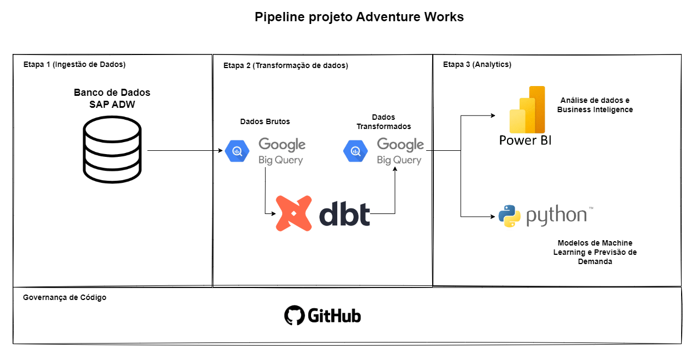
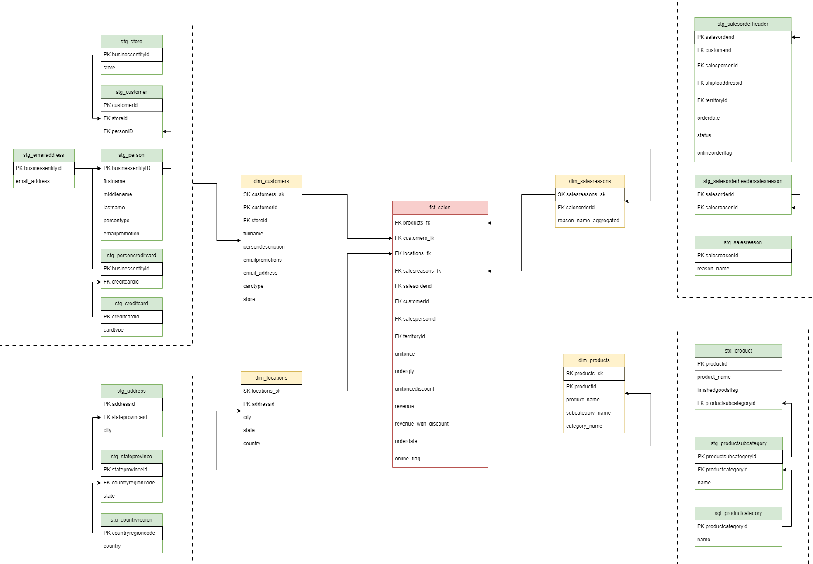
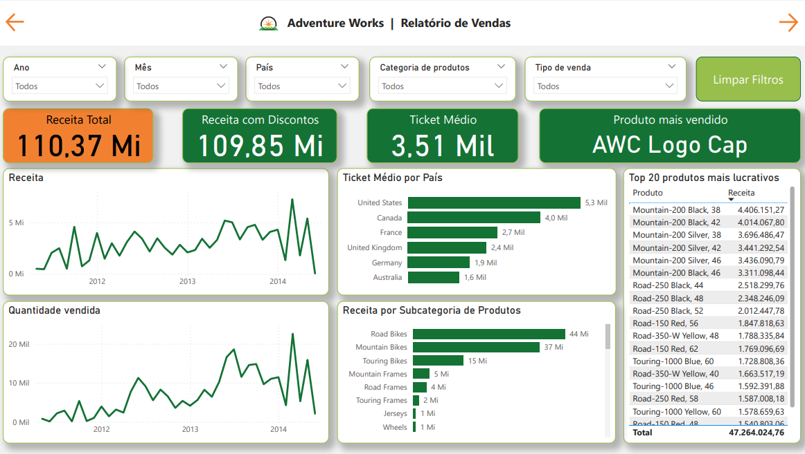
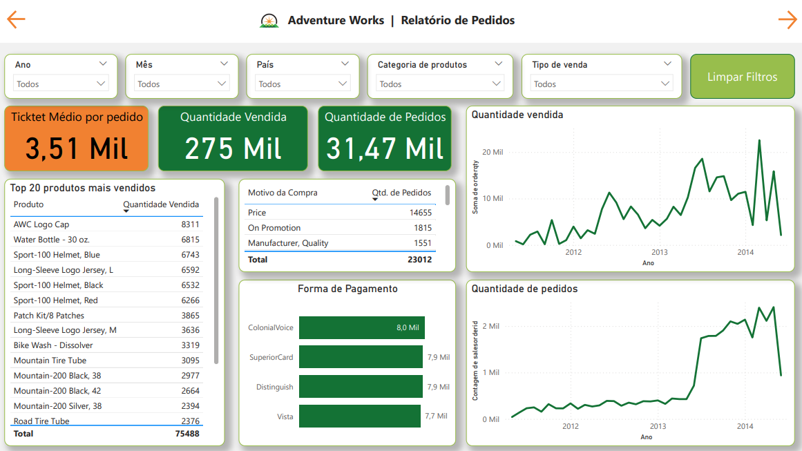
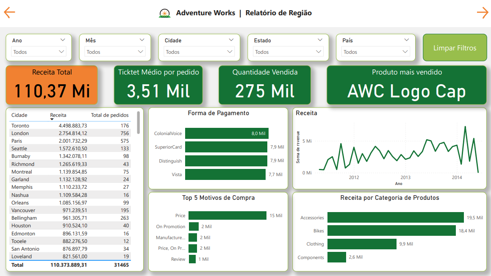
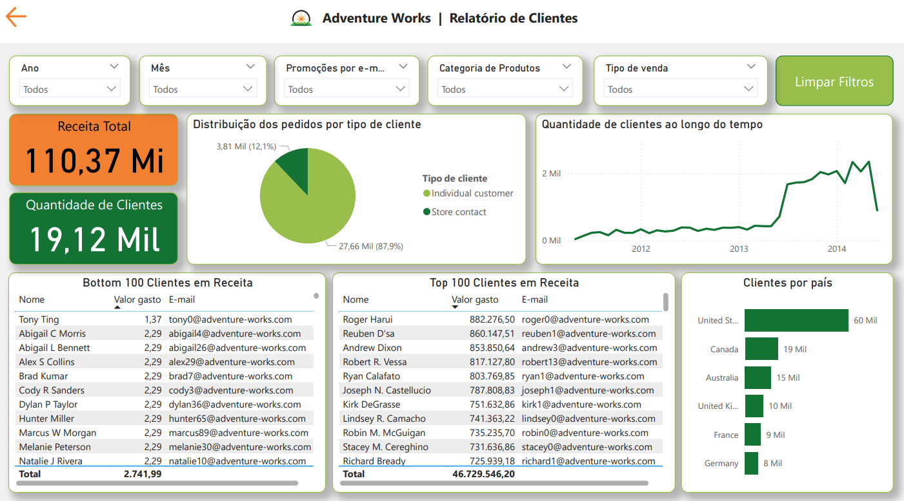

# Adventure Works | Projeto de Analytics e Previsão de Demanda

Este presente repositório de código refere-se ao projeto de Analytics e Previsão de Demanda, utilizando-se do banco de dados público Adventure Works. Aqui estão presentes toda a parte de modelagem, e notebooks e demais arquivos utilizados para construção do projeto.

## Objetivos

- Realizar a transformação e análise dos dados brutos da Adventure Works
- Utilizar-se dos dados tratados e modelos para produzir insights valiosos ao negócio, utlizando-se de ferramentas de visualização de dados, aplicando-se conceitos de Business Intelligence.
- A partir dos desenvolvimentos de analytics, realizar também uma previsão de demanda por produto e por loja, para os diversos centros de distribuição.
- Realizar todos estes desenvolvimentos partindo-se de princípios de implementação de uma infraestrutura de dados moderna, alinhados à metodologia Modern Data Stack (MDS).

## Ferramentas utilizadas para o desenvolvimento do projeto

- DBT Cloud: Utilizado para o tratamento, modelagem dos dados brutos, visando o desenvolvimento e implementação do star schema destes dados, garantindo uma organização eficiente e fácil acesso aos dados para análises avançadas.
- Google BigQuery: Serviu como o Data Warehouse, armazenando os dados tratados e modelados.
- Power BI: Utilizado para a análise de dados, criação de dashboards interativos e visualização dos principais insights extraídos dos dados.
- Python: Em um notebook Python, conectamos ao BigQuery para desenvolver modelos preditivos de previsão de demanda.

Desta forma, seguindo a metodologia MDS, combinou-se as ferramentes para o desenvolvimento da arquitetura e fluxo de dados, conforme segue abaixo.

## Etapa de Ingestão dos Dados

Para a etapa de ingestão dos dados neste projeto, utilizou-se do [repositório](https://github.com/techindicium/academy-dbt), onde todas as tabelas do banco fonte do SAP da Adventure Works já estão criadas.

Para carregá-las como seeds pelo dbt no Big Query, utilizou-se do seguinte comando no DBT Cloud:
- `dbt seed`

## Star Schema

Como etapa fundamental de desenvolvimento deste projeto, foi criado o modelo star schema, uma estrutura de banco de dados comumente usada em Data Warehouses e soluções de analytics. Desta forma, foram definidas a tabela fato de vendas, com as métricas de negócios principais e respectivas chaves de conexão as tabelas de dimensões, que fornecem contextos adicionais as análises, como dados de produtos, clientes, localidades, etc.

Segue na imagem abaixo o Star Schema desenvolvido.

## Analytics

### Dashboard

Após os devidos tratamentos e modelagem dos dados, utilizou-se do Power BI para o desenvolvimento da parte de Business Inteligence do projeto. Abaixo estão os prints de cada uma das páginas do dashboard desenvolvido. Para acessar o dashboard completo, siga este [link](bi_project/dashboard_adw.pbix).

#### Menu inicial

Na primeira página do dashboard, encontra-se o menu inicial com os links para acesso a cada uma das páginas de interesse, sendo elas: relatório de vendas, relatório de pedidos, relatório de região e relatório de clientes.

#### Relatório de Vendas

A ideia do relatório de vendas é apresentar os principais "big numbers" da base de dados, como a Receita Total, Receita Total considerando os descontos, Ticket Médio, Produto mais vendido, além da distribuição da receita e quantidade vendida ao longo do tempo, ticket médio por país, receita por subcategoria de produtos e uma lista do top20 produtos mais rentáveis para a Adventure Works. Todas estas visualizações podem ser filtradas por ano, mês, páis, categoria de produto e tipo de venda (online ou por vendedores).

#### Relatório de Pedidos

O relatório de pedidos apresenta as principais visualizações relacionadas a pedidos, como ticket médio por pedido, quantidade vendida, quantidade de pedidos, distribuição dos pedidos e quantidade ao longo do tempo, top 20 produtos mais vendidos em quantidade, os principais motivos de venda e principais formas de pagamento. Os filtros seguem os mesmo da página anterior.

#### Relatório de Região

Nesta página, apresenta-se os principais números de pedidos e vendas relacionados as regiões de vendas, país, estado e cidade.

#### Relatório de Clientes

Na última página do dashboard, apresenta-se a quantidade de clientes, a distribuição dos pedidos por tipo de cliente, distribuição de clientes ao longo do tempo e a quantidade de clientes por país. Além disso, destaca-se do bottom 100 clientes com menor receita agregada (importante para realizar ações de benchmarking via e-mail por exemplo, para tentar atrair novamente estes clientes) e o top 100 clientes com maior receita agregada, também importante para ações voltadas a fidelização, descontos especiais e possíveis "clubes" de assinatura.

### Machine Learning

As soluções de machine learning estão descritas no notebook *LINK*.
